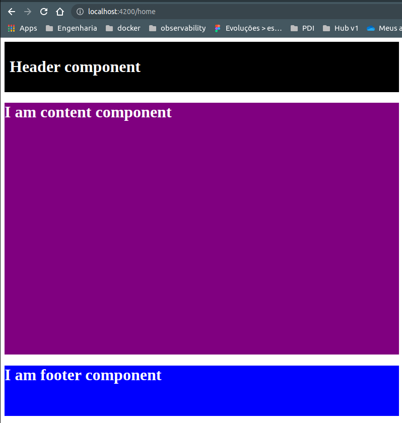

  

   

  Criar e manter uma Single Page Application de maneira totalmente dinâmica e reutilizável.
  Foque apenas na construção e qualidade dos componentes e através de um arquivo JSON você será capaz de "invocá-los" em qualquer rota. 

  <a href="#primeiros-passos">Primeiros passos</a> • 
  <a href="#documentacao">Documentação</a> • 
  <a href="#autor">Autor</a>

 
 
 

# Status

 
 

# Primeiros passos

Instalar com npm: <code>npm install ngx-dynamic-pages</code>

Criar arquivo que retorna uma lista de componentes disponíveis para serem consumidos através do JSON Parametrizado.

<code>store-components.ts</code>

<pre>
import { ContentComponent } from "../components/content/content.component";
import { FooterComponent } from "../components/footer/footer.component";
import { HeaderComponent } from "../components/header/header.component";

export const components = [
    {
        key: 'header',
        component: HeaderComponent
    },
    {
        key: 'content',
        component: ContentComponent
    },
    {
        key: 'footer',
        component: FooterComponent
    }
];
</pre>

 
 

Criar arquivo que exporta um json estruturado (JSON Parametrizado):

<code>json-parametrizado.ts</code>
<pre>
import { IJsonParameterize } from "ngx-dynamic-pages";

export const json: IJsonParameterize[] = [
    {
        "route": "/home",
        "components": [
            {
                "componentName": "header",
                "inputs": {
                    "title": "Header component",
                    "titleColor": "white",
                    "bgColor": "black",
                    "padding": "10px"
                }
            },
            {
                "componentName": "content",
                "inputs": {
                    "height": "500px",
                    "bgColor": "purple"
                }
            },
            {
                "componentName": "footer",
                "inputs": {
                    "height": "100px",
                    "bgColor": "blue", 
                    "description": "I am footer component"
                }
            }
        ]
    }
]
</pre>

 
 

Importar e configurar o módulo <code>NgxDynamicPagesModule</code> com os arquivos anteriormente criados:

<pre>
@NgModule({
  declarations: [
    AppComponent,
    ButtonComponent,
    HomeComponent,
    AboutComponent,
    HeaderComponent,
    ContentComponent,
    FooterComponent
  ],
  imports: [
    AppRoutingModule,
    BrowserModule,
    NgxDynamicPagesModule.forRoot(
      {
        jsonParameterize: json,
        storeComponents: components
      } as IDynamicPagesConfig
    )
  ],
  providers: [],
  bootstrap: [AppComponent]
})
export class AppModule { }
</pre>

 
 

Configurar o arquivo root de rotas com um path coringa (**), isto é, aceita qualquer url definida no JSON Parametrizado:

<pre>
import { NgxDynamicPagesComponent } from 'ngx-dynamic-pages';

const routes: Routes = [
  {
    path: "**",
    component: NgxDynamicPagesComponent
  }
];

@NgModule({
  imports: [RouterModule.forRoot(routes)],
  exports: [RouterModule]
})
export class AppRoutingModule { }
</pre>

 
Como resultado, temos: 

 
 
 

# Como funciona
Ao contrário do desenvolvimento convencional de SPAs, onde cada página possui sua pŕopria rota, no Dynamic Pages existe apenas um único ponto de entrada.

Por exemplo, como criamos uma página home?

Primeiro precisamos criar o componente <code>HomeComponent</code>,
adicioná-lo no arquivo de rotas como path <code>home</code> e adicionar os componentes necessários para essa página.

E se quisermos uma página about? contacts?
O processo seria o mesmo.
Com Dynamic Pages você apenas cria as peças e define como e onde elas serão invocadas.

 

A <code>store-components.ts</code> armazena uma lista de componentes, onde cada componente possui um identificador (key) e sua própria referência (component).
É através dessa key que dizemos qual componente deverá ser exibido na página.

<pre>
export const components = [
    {
        key: 'header',
        component: HeaderComponent
    },
    {
        key: 'content',
        component: ContentComponent
    },
    {
        key: 'footer',
        component: FooterComponent
    }
];
</pre>

| Propriedades  | Descrição                                                                                                               |
| -----------   | -----------                                                                                                             |
| key           | Identificador do componente. Usado posteriormente no <code>json-parametrizado.ts</code> para ser renderizado na página  |
| component     | Classe do componente                                                                                                    | 

 
 

O arquivo <code>json-parametrizado.ts</code> deverá retornar uma lista de rotas onde cada rota possui uma lista de componentes.

<pre>
  [
    {
      "route": "/home",
      "components": [
        {
          "componentName": "header",
          "inputs": {
            "title": "Any title to my header"
          }
        }
      ]
    }
  ]
</pre>

| Propriedades          | Descrição                                                                                   |
| -----------           | -----------                                                                                 |
| route                 | Path que acessamos na url do navegador, ex: localhost:4200/home                         |
| components            | Lista de componentes que serão criados na página                                            | 
| componentName         | Identificador do componente, o mesmo valor registrado em <code>store-components.ts</code>   |
| inputs                | Dados de entrada do componente                                                              |

 
 

No arquivo <code>app-routing.module.ts</code> devemos ter a seguinte configuração:
<pre>
const routes: Routes = [
  {
    path: "**",
    component: NgxDynamicPagesComponent
  }
];

@NgModule({
  imports: [RouterModule.forRoot(routes)],
  exports: [RouterModule]
})
export class AppRoutingModule { }
</pre>

onde precisamos configurar o path do <code>NgxDynamicPagesComponent</code> como (**).
Dessa forma as rotas que forem configuradas no <code>json-parametrizado.ts</code> serão interpretadas e o processo de criação dos componentes irá acontecer.

 
 
 

# Autor

Carlos Daniel &nbsp;&nbsp;• &nbsp;&nbsp;Software Engineer

<pre>
"Good logic helps us solve problems in our lives, but feelings, perceptions and love help solve what we cannot with logic."
</pre>